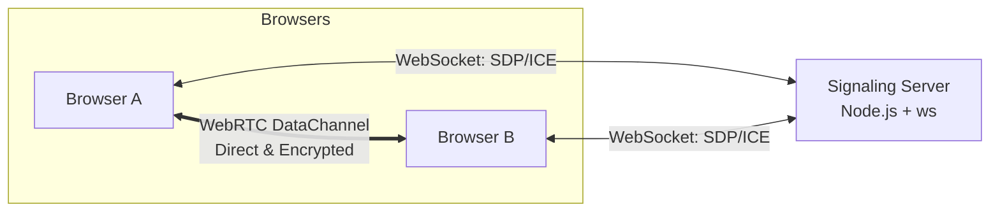

# DropLink

[](https://opensource.org/licenses/MIT)
[](https://nodejs.org/)
[](https://webrtc.org/)

**DropLink** is a decentralized, zero-storage peer-to-peer sharing platform. Files, folders, links, and chat messages move **directly between browsers** over an encrypted WebRTC connection. The server only facilitates the initial handshake and never sees, stores, or touches a single byte of your data.

## 🚀 Key Features

- 🔒 **Zero Storage** — Nothing is written to disk or a database, ever.
- 🤝 **True Peer-to-Peer** — Transfers use WebRTC DataChannels, bypassing upload/download servers.
- 🔐 **End-to-End Encrypted** — Every chunk and message is encrypted client-side with AES-256-GCM before leaving the browser.
- ⏳ **Ephemeral Rooms** — Rooms exist only in memory and expire automatically after inactivity.
- 🚫 **No Accounts, No Tracking** — Join with a simple room code or QR scan; no personal data required.
- 📁 **Folder Sharing** — Supports directory sharing with automatic client-side ZIP reconstruction.
- 🌓 **Adaptive UI** — Fully responsive glassmorphism interface with dark and light mode support.

---

## 🏗️ Architecture



- **Signaling Server** (`server/`): A lightweight Express + WebSocket (`ws`) service that manages room codes and relays WebRTC handshake signals (SDP/ICE).
- **P2P Mesh** (`client/`): Vanilla JavaScript implementation that establishes direct `RTCPeerConnection` between all peers in a room. Data is chunked (16KB) and encrypted using the Web Crypto API.

---

## 🛠️ Tech Stack

- **Frontend**: Vanilla JavaScript, HTML5, CSS3 (Glassmorphism, CSS Variables)
- **Backend**: Node.js, Express.js
- **Signaling**: WebSocket (`ws`)
- **Transport**: WebRTC `RTCDataChannel`
- **Security**: Web Crypto API (AES-256-GCM, PBKDF2)
- **Utilities**: [qrcodejs](https://github.com/davidshimjs/qrcodejs), [JSZip](https://stuk.github.io/jszip/)

---

## 📦 Installation

### Prerequisites
- **Node.js** ≥ 18.0.0
- **npm** (comes with Node.js)

### Setup
```bash
# Clone the repository
git clone https://github.com/vincenzo-afk/DropLink.git

# Navigate to the project directory
cd DropLink

# Install dependencies
npm install
```

---

## 🚦 Getting Started

### Local Development
To start the server in production mode:
```bash
npm start
```

For development with automatic restarts on file changes:
```bash
npm run dev
```

The application will be available at `http://localhost:3000`. To test P2P functionality, open the URL in two different browser tabs or devices.

### Environment Variables
- `PORT`: Override the default port (3000).
  ```bash
  PORT=8080 npm start
  ```

---

## 🔒 Security Model

1. **Key Derivation**: A shared AES-256-GCM key is derived via PBKDF2 from the unique room code.
2. **Data Privacy**: The signaling server only tracks active WebSocket connections in an in-memory `Map`. It never receives file chunks or chat content.
3. **Room Expiry**: Rooms are purged from memory after 2 minutes of being empty or 30 minutes of total inactivity.

---

## 📂 Project Structure

```text
DropLink/
├── client/
│   ├── assets/        # Visual assets (logo, favicon)
│   ├── css/           # Styling (glassmorphism system)
│   ├── js/            # Core logic (WebRTC, Crypto, Chat)
│   ├── index.html     # Landing page
│   └── room.html      # Room interface
├── server/
│   ├── roomManager.js # In-memory room management
│   ├── signaling.js   # WebSocket signaling logic
│   └── server.js      # Express server entry point
├── package.json       # Project metadata & dependencies
└── LICENSE            # MIT License
```

---

## 🤝 Contributing

Contributions are welcome! Please feel free to submit a Pull Request.

1. Fork the Project
2. Create your Feature Branch (`git checkout -b feature/AmazingFeature`)
3. Commit your Changes (`git commit -m 'Add some AmazingFeature'`)
4. Push to the Branch (`git push origin feature/AmazingFeature`)
5. Open a Pull Request

---

## 📜 License

Distributed under the MIT License. See `LICENSE` for more information.

---

## 🌟 Acknowledgments

- Inspired by the need for simple, private file sharing.
- Built with vanilla technologies for maximum performance and compatibility.
